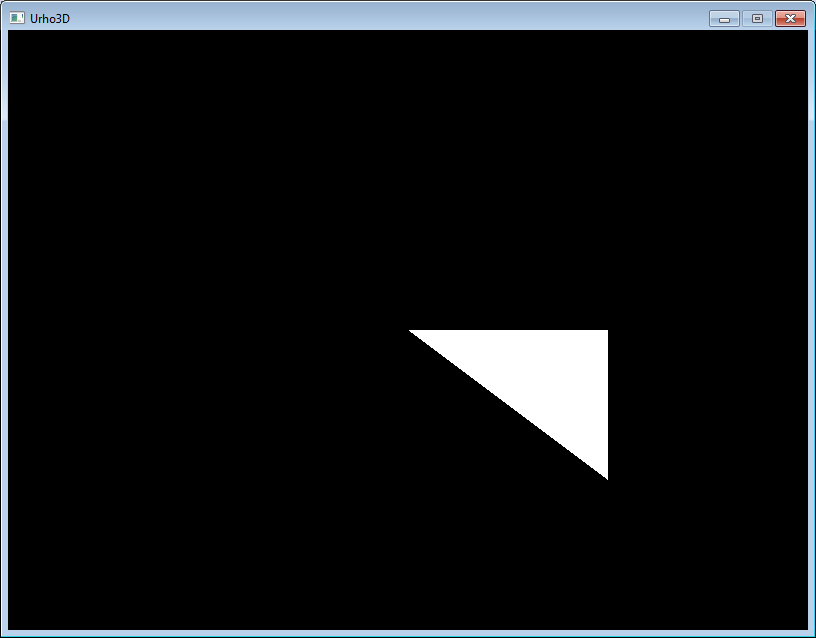
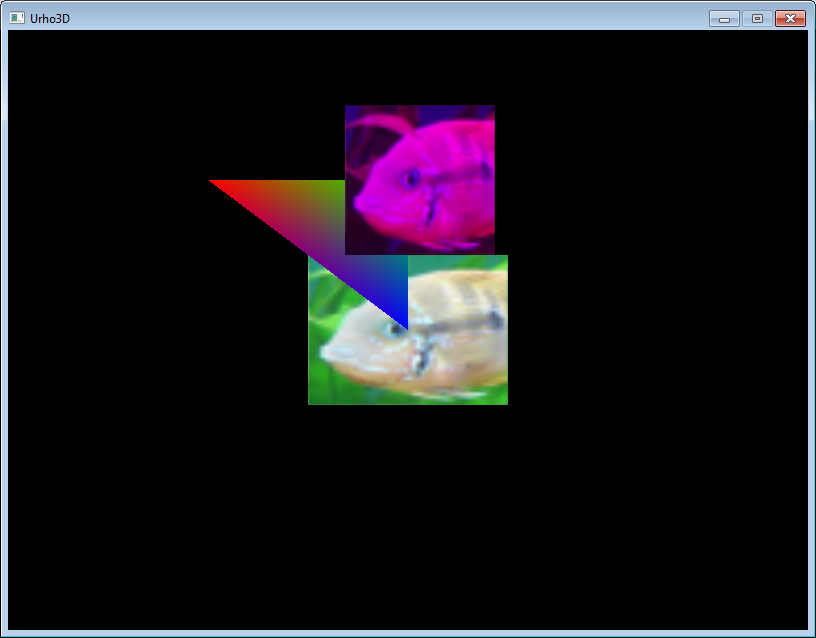
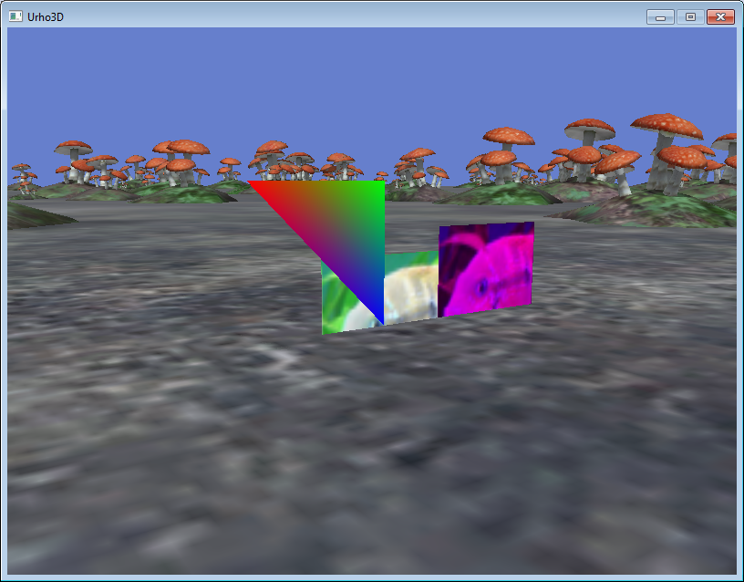
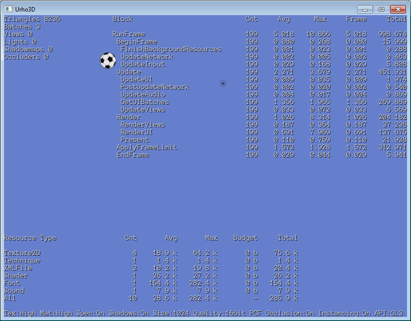

# Прямое использование графических API

Urho3D является сцено-ориентированным движком. То есть вы просто создаете иерархию объектов, определяете их свойства и поведение, и всё там живёт своей жизнью, самостоятельно рендерится и тому подобное. Это удобно в подавляющем большинстве случаев. Но иногда вам может понадобиться олдскульный подход, когда вы каждый кадр сами рисуете содержимое экрана. Ярчайшим примером такого подхода является игра Terraria, где весь мир хранится в гигантском двухмерном массиве, а на экран выводятся только видимые тайлы.

## Внедряемся в движок

На каждой стадии своей работы движок генерирует события, и это открывает широкие возможности для того, чтобы на любом этапе вмешаться в работу движка и сделать что-то свое. Рассмотрим некоторые из этих событий.

```
void Engine::Render()
{
    GetSubsystem<Renderer>()->Render(); // Рендерится игра
    GetSubsystem<UI>()->Render(); // Рендерится интерфейс
    graphics->EndFrame();
}

void Renderer::Render()
{
    graphics_->Clear(...);
    // Очистка экрана. Все события до этого момента не пригодны для ручной прорисовки

    for (...) // Цикл рендерит все вьюпорты
        views_[i]->Render();

    // Функция View::Render() генерирует серию событий. Событие E_ENDVIEWRENDER возникает последним
    // и пригодится, если вы хотите внедрить свою геометрию в уже отрендеренную сцену. Но нам оно не
    // подходит, так как у нас вообще не будет ни одного вьюпорта и ни одной сцены, так что эти
    // события даже не будут возникать

    SendEvent(E_ENDALLVIEWSRENDER);
    // Это то, что нам нужно. Рисуем здесь свою геометрию и она будет находиться под интерфейсом
    // (вдруг вам понадобится отладочный худ)
}

void Graphics::EndFrame()
{
    SendEvent(E_ENDRENDERING);
    // Это событие возникает после рендеринга интерфейса. Может быть полезно, если вы хотите
    // самостоятельно нарисовать анимированный курсор мыши
}
```

## Рисуем треугольник

Urho3D поддерживает OpenGL и DirectX. Между ними довольно много [различий](https://urho3d-doxygen.github.io/1_9_0_tutors/_a_p_i_differences.html), но Urho3D [унифицирует](https://urho3d-doxygen.github.io/1_9_0_tutors/_conventions.html) доступ к обоим API там, где это возможно.
Для прямого вызова функций графического API предназначен класс Graphics. Обратитесь к примеру [step1/src/game.cpp](step1/src/game.cpp). Всё проще некуда:

1. Создаем вершинный буфер и записываем в него координаты трех вершин. Помните, что вершины нужно задавать [по часовой стрелке](https://urho3d-doxygen.github.io/1_9_0_tutors/_conventions.html), так как порядок вершин определяет лицевую грань полигона.
2. Устанавливаем текущий вершинный буфер и текущую шейдерную программу (в общем, настраиваем Render State).
3. Вызываем функцию Graphics::Draw(...), которая отрендерит текущую геометрию текущим шейдером.

Код из примера без изменений скомпилируется как для OpenGL, так и для DirectX, однако шейдеры для разных API требуются разные: [glsl](result/step1_data/Shaders/GLSL/White.glsl), [hlsl](result/step1_data/Shaders/HLSL/White.hlsl). Urho3D сам будет загружать нужный шейдер, в зависимости от используемого API.



В примере показаны два способа задания формата вершин: старый с фиксированным порядком элементов (атрибутов) и более новый с произвольным порядком (с одним исключением: координаты вершины всегда должны быть первыми, чтобы работал рейкаст). Второй способ был добавлен в [этом патче](https://github.com/urho3d/Urho3D/pull/1320). Кстати, это также стало причиной изменения [формата моделей](https://urho3d-doxygen.github.io/1_9_0_tutors/_file_formats.html). Порядок атрибутов можно посмотреть [тут](https://urho3d-doxygen.github.io/1_9_0_tutors/_vertex_buffers.html) или в файле `Urho3D/GraphicsAPI/GraphicsDefs.h`.

## Индексные буферы и собственный убершейдер

В первом примере для описания модели использовался только вершинный буфер. На практике так поступают редко. К примеру, возьмем квадрат. Он составляется из двух треугольников. Значит, требуется шесть вершин, причем две вершины одинаковы для обоих треугольников. В среднестатистической модели число совпадающих вертексов огромно. Поэтому все уникальные вершины хранятся в вершинном буфере, а сами модели описываются с помощью дополнительного индексного буфера, который вместо самих вершин хранит индексы вершин из вертексного буфера.

Обратитесь ко [второму примеру](step1/src/game.cpp). Исходник кажется большим, но на самом деле там значительный объем занимает создание вершин.



В отличие от первого примера, здесь в вершинах помимо 3D-координат хранятся еще два атрибута: цвет и текстурные координаты. Вершины всех трех геометрических объектов имеют одинаковый формат (и даже хранятся в одном вертексном буфере), но фигуры выглядят по-разному, так как для их рендеринга используется три разных шейдера: шейдер, который учитывает только цвет вершин, шейдер, который использует UV-координаты и накладывает текстуру и шейдер, делающий и то и другое. Все три шейдера реализованы как один убершейдер ([glsl](result/step2_data/Shaders/GLSL/MyUberShader.glsl), [hlsl](result/step2_data/Shaders/HLSL/MyUberShader.hlsl)), участки кода в котором включаются и выключаются с помощью дефайнов.

Обратите внимание на центральный прямоугольник. На самом деле он является квадратом. Дело в том, что оконные координаты находятся в диапазоне [-1, 1] по вертикали и горизонтали (ось Y направлена вверх), а само окно не квадратное. Поэтому происходит искажение. Фиолетовый квадрат имеет абсолютно те же размеры, однако он скорректирован с помощью матрицы модели. На эту матрицу умножаются координаты каждой вершины в функции GetWorldPos() (смотрите шейдер Transform).

Как упоминалось выше, вы можете внедрять геометрию в уже отрендеренную сцену. Для этого нужно включить использование буфера глубины, который уже был заполнен во время рендеринга сцены

```
graphics->SetDepthTest(CMP_LESSEQUAL);
```

и воспользоваться матрицами из камеры

```
graphics->SetShaderParameter(VSP_VIEWPROJ, camera->GetGPUProjection() * camera->GetView());
```

Чтобы геометрия была видна с обеих сторон, можно также отключить отбрасывание задних граней

```
graphics->SetCullMode(CULL_NONE);
```

Естественно, при выводе геометрии подобным образом на нее не будут действовать никакие источники света, если вы сами не передадите информацию об освещении в шейдеры.



Полный исходник не приводится, поскольку он тривиален.

## Батчинг

Число драв коллов (вызовов функции Draw) и переключений стейта (Render State) при рендеринге должно быть минимизировано (смотрите [Оптимизация OpenGL](http://developer.amd.com/wordpress/media/2012/10/KRI%202006-OpenGL%20optimizations.pdf) и [Direct3D Performance Optimizations](https://msdn.microsoft.com/ru-ru/library/windows/desktop/bb147263(v=vs.85).aspx)). Кстати, есть интересная [статья](https://www.nvidia.com/docs/IO/8228/BatchBatchBatch.pdf), разъясняющая, что узким местом при этом является процессор, а не видеокарта. Все, что можно отрендерить без переключения шейдеров и текстур, необходимо сгруппировать (именно поэтому эффективны текстурные атласы).

Обратитесь к третьему примеру [SpriteBatch.h](main/step3/src). Принцип работы очень прост:

1. Когда пользователь вызывает функцию SpriteBatch::Draw(), спрайт не рендерится мгновенно, а просто добавляется в список.
2. При вызове функции SpriteBatch::End() все подряд идущие спрайты с одинаковой текстурой записываются в один буфер и выводятся за один Draw Call.



Этот пример является максимально урезанной и упрощённой версией SpriteBatch, который включён в движок.

---

*Старая версия урока: <https://github.com/1vanK/Urho3DTutor01>.*
